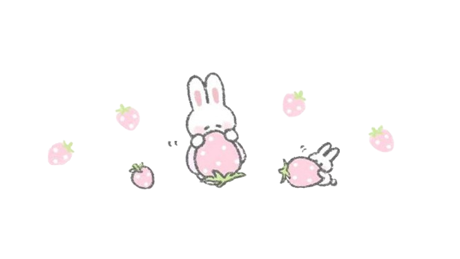
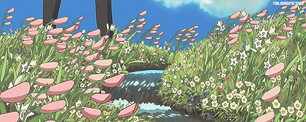

<!-- Replace with your header GIF -->

# 🌸✨ Welcome to My Enchanted Garden ✨🌸

<!-- Replace with your main Ghibli GIF (like Howl's castle, Totoro, etc.) -->

### *Hi there, I'm Anshika* 🌙💫

*A product designer and developer who believes in crafting digital spaces that feel like a warm embrace*

<!-- Replace with your divider GIF -->

## 🏰 About My Creative Journey

<!-- Replace with a cozy Ghibli scene (side image) -->

Just like the gentle flow of a Ghibli film where every moment is filled with wonder, I believe in creating digital experiences that feel magical and meaningful. I'm here to build cozy corners of the internet where imagination meets reality.

**Currently nurturing in my garden:**
- 🌿 Growing design systems that bloom with intention
- 🎨 Painting user experiences with care and creativity  
- ✨ Weaving code and magic into delightful interactions
- 🌙 Exploring the art of thoughtful architecture
- 🦋 Contributing to communities that believe in better digital worlds

 

<!-- Replace with your section divider -->

## 🎨✨ My Creative Toolkit ✨🎨

*The magical tools I use to bring dreams to life*

### 💫 Languages I Speak

### 🌟 Tools & Frameworks

### 🎭 Design & Creation

<!-- Replace with your stats section divider -->

## 📊✨ My Journey in Numbers ✨📊

<!-- Replace with a cute coding/stats GIF -->

  

 

 

<!-- Trophies with pink theme -->

<!-- Replace with your decorative divider -->

## 🌸💌 Let's Create Something Magical Together 💌🌸

<!-- Replace with a small cute GIF (like Jiji, soot sprites, etc.) -->

*I'm always excited to collaborate on projects that bring a little more magic into the world*

 

<!-- Replace with your section divider -->

## 💭 A Little About Me

<!-- Replace with a cozy cat/character GIF (Jiji would be perfect!) -->

  

🌙 *I code under the stars and design with the morning light*

🐱 *My pixel art cats are my loyal companions through every commit*

🍵 *Fueled by warm tea, wonder, and Studio Ghibli soundtracks*

✨ *Believer in the magic hidden in thoughtful details*

🌸 *Creating digital meadows where creativity blooms freely*

🦋 *Every line of code is a small spell of possibility*

   

 

<!-- Replace with a landscape/scenery GIF -->

<!-- Replace with your footer divider -->

### *"In this garden of code and creativity, every project is a new adventure"* 🌟✨

<!-- Replace with your final divider -->

